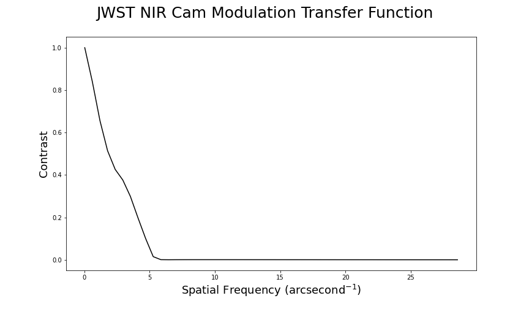

# Quantifying Optical Performance of James Webb Space Telescope

This is my Physics 140 final.

We successfully generated the Modulation Transfer Function curve of the James Webb Space Telescope’s NIR Camera using its Point Spread Function.

The write up can be found in the file [Paper.pdf](Paper.pdf)

The code can be found in the file [Code.ipynb](Code/Code.ipynb)
